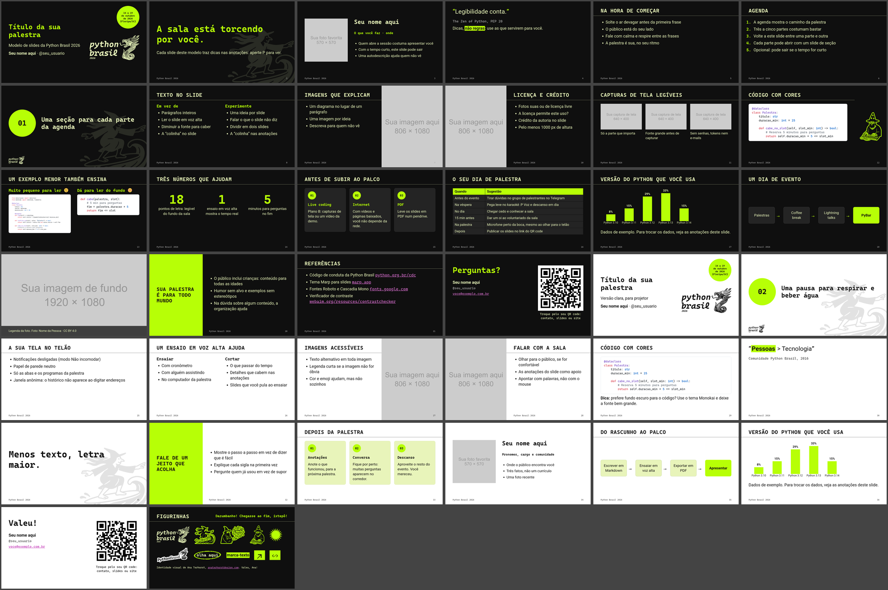

# Slides da Python Brasil 2026 em Markdown

Monte a sua palestra para a [Python Brasil 2026](https://2026.pythonbrasil.org.br/) conversando com um agente de IA, em Markdown puro. Deixe o seu agente favorito ler o [`AGENTS.md`](AGENTS.md) e escrever os slides com os layouts e as regras da marca. Cada push publica a apresentação no GitHub Pages, com um PDF junto.

Os blocos de código saem coloridos sozinhos. Escreva ` ```python ` e o código, e o tema aplica as cores do Monokai num cartão escuro, com a fonte Cascadia Mono, nos slides escuros e nos claros. Não precisa copiar o código de outro site nem colar imagem.


O tema usa o [Marp](https://marp.app/) e a identidade visual do evento: cores, fontes, logo e figurinhas.

Prefere PowerPoint, LibreOffice ou Google Slides? Use o [modelo em `.pptx`](https://github.com/rodbv/pybr2026-slides).



## Começar

1. Clique em **Use this template > Create a new repository**.
2. No repositório novo, abra **Settings > Pages** e escolha **GitHub Actions** em **Source**.
3. Edite o `slides.md`. A cada push na `main`, a Action publica os slides em `https://SEU-USUARIO.github.io/NOME-DO-REPOSITORIO/` e o PDF em `.../slides.pdf`.

Esse endereço serve para o QR code do encerramento: o público abre os seus slides no celular.

## Com um agente de IA

Abra o repositório no seu editor com o agente e descreva a palestra. Por exemplo:

```
Quero uma palestra de 25 minutos sobre testes com pytest para quem está começando.
Escreva os slides em slides.md, no lugar dos exemplos, com uma capa, uma agenda de
três partes, uma seção para cada parte, dois slides de código e o encerramento.
Coloque nas anotações o que eu vou falar em cada slide.
```

O `AGENTS.md` diz ao agente quais layouts existem, como escrever cada um, e as regras da marca e do conteúdo: até 8 linhas de código por slide, texto alternativo em toda imagem, limão como cor de texto só no fundo escuro, linguagem neutra de gênero. O `CLAUDE.md` aponta para o mesmo arquivo.

Depois, peça ajustes como faria a uma pessoa: "divida o slide 7 em dois", "troque a tabela por um fluxo", "deixe as anotações mais curtas".

## No VS Code

1. Abra a pasta do repositório. O VS Code sugere a extensão **Marp for VS Code**: instale.
2. Abra o `slides.md` e clique no botão de visualização, no canto de cima. O tema já vem configurado.
3. Para exportar, use **Marp: Export Slide Deck** na paleta de comandos e escolha HTML, PDF ou PPTX. O PDF e o PPTX precisam do Chrome, do Edge ou do Firefox instalado.

Também dá para editar o `slides.md` direto no GitHub, pelo navegador: a Action publica do mesmo jeito.

## Apresentar

Abra o endereço do GitHub Pages ou o HTML exportado no navegador.

- **F**: tela cheia.
- **P**: abre a visão do apresentador numa janela nova, com as anotações, o próximo slide e o cronômetro. As duas janelas andam juntas: deixe a do apresentador na sua tela e a dos slides no projetor. Para sair, feche a janela do apresentador.
- Setas ou espaço: próximo slide.

Leve também o PDF num pendrive: ele abre em qualquer computador, sem internet.

## Layouts

Cada slide escolhe o layout com um comentário no topo, como `<!-- _class: secao -->`. Os exemplos do `slides.md` mostram todos eles, e o [`AGENTS.md`](AGENTS.md) traz o Markdown que cada um espera.

| Classe | Para |
|---|---|
| (nenhuma) | Título e tópicos, tabela, código ou imagem |
| `capa` | Título da palestra, nome e o selo da data |
| `frase` | Uma frase só, grande |
| `secao` | Divisor com o número no disco limão |
| `duas-colunas` | Antes e depois, problema e solução, dois trechos de código |
| `numeros` | Três números grandes com rótulo |
| `cartoes` | Três blocos numerados com título e descrição |
| `fluxo` | Passos em caixas ligadas por setas |
| `tres-imagens` | Três capturas de tela com legenda |
| `palestrante` | Foto, nome, cargo e três fatos |
| `destaque` | Painel limão com a mensagem que a sala não pode perder |
| `imagem-cheia` | Foto de fundo com faixa de legenda |
| `encerramento` | "Perguntas?" ou "Valeu!", contatos e QR code |
| `figurinhas` | Logo, figurinhas, círculo pixelado e marca-texto |
| `light` | Versão clara de qualquer layout: `<!-- _class: frase light -->` |

Para texto ao lado de uma imagem, use a sintaxe do Marp: ``.

## Gráfico e QR code

O Marp não tem gráfico nativo. Os scripts em `scripts/` geram as imagens nas cores da marca, com [uv](https://docs.astral.sh/uv/):

```sh
uv run scripts/qr.py https://seu-usuario.github.io/sua-palestra/
uv run scripts/grafico.py
```

O `qr.py` troca o `img/qr.png`. O `grafico.py` mostra como fazer um gráfico de barras com matplotlib no estilo do tema; copie e troque os dados.

## Acessibilidade

- O texto do corpo tem 36 px num slide de 1280 px, o mesmo que 20 pt no modelo em `.pptx`. Nada abaixo de 18 pt para quem senta longe.
- Todas as combinações de cor do tema passam no nível AA do WCAG 2.1. As cores e o contraste de cada uma estão no [README do modelo em `.pptx`](https://github.com/rodbv/pybr2026-slides#cores-e-contraste).
- O idioma do documento é português do Brasil, para leitores de tela.
- Escreva o texto alternativo entre os colchetes de cada imagem: ``.

## Licenças

- Código deste repositório: MIT.
- Logo, figurinhas e identidade visual: Python Brasil 2026 e APyB, do brandboard oficial do evento, criado por [Ana Terhorst](https://anaterhorstdesign.com).
- Fontes Roboto e Cascadia Mono: SIL Open Font License 1.1, carregadas do Google Fonts.
