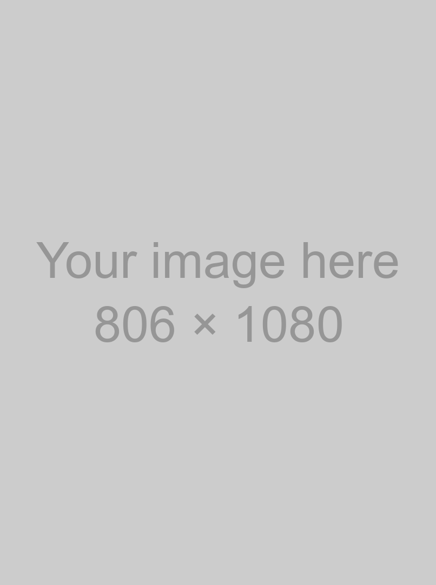
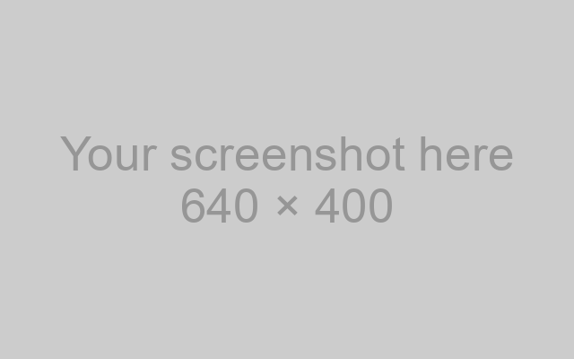
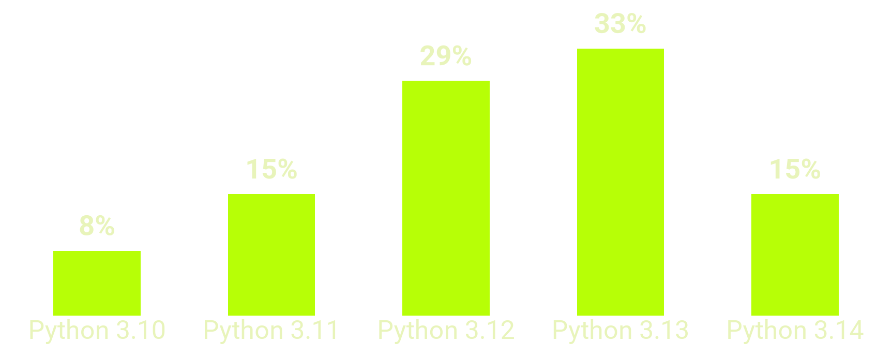
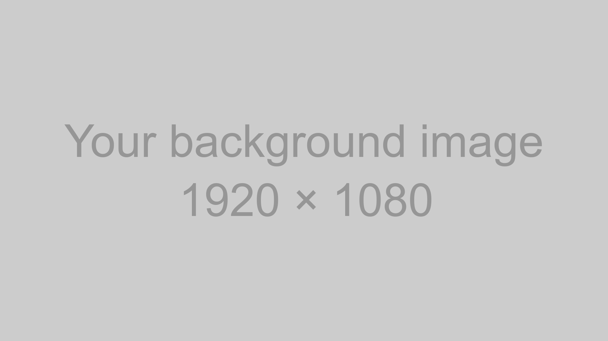
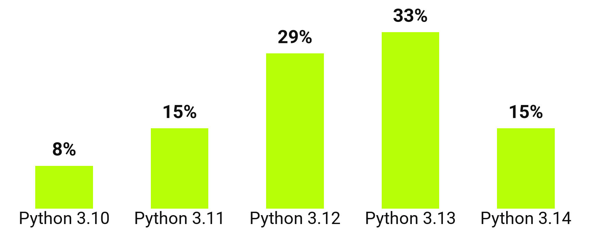

<!-- _class: capa -->
<!-- _paginate: false -->
<!-- _footer: "" -->

<div class="selo">October<br>14 to 19<br>2026<br>{Floripa/SC}</div>

# Your talk title

Python Brasil 2026 slide template

**Your name here** · @your_username

<!--
- We're glad you're speaking! This file is a template: the example slides show each layout, with tips in the speaker notes.
- To get started: copy the slides you want to use and delete the examples. The _class comment at the top of each slide sets the layout.
- Each slide has a tip; use the ones that work for you. The light versions of the layouts come after the dark closing slide.
-->

---

<!-- _class: frase -->

# The room is cheering for you.

Every slide in this template has tips in the speaker notes: press P to see them.

<!--
- One idea per slide, in up to two lines. What sentence should the audience take home?
- Almost every speaker feels nervous. If you feel nervous, speak to one friendly face in the audience.
- If something fails, calmly say what happened and continue: the room forgets in minutes.
-->

---

<!-- _class: palestrante -->


# Your name here

### What you do · where

- The session chair often introduces you
- If time is short, you can skip this slide
- Describing yourself helps people who cannot see

<!--
- The session chair often introduces you; if time is short, you can skip this slide.
- Describing yourself helps people who cannot see. For example: "I'm Maria. I'm 1.60 m tall, with loose black hair, green glasses and a PyLadies T-shirt."
-->

---

> Practicality beats purity.

The Zen of Python, PEP 20

Tips, <mark>not rules</mark>: use the ones that work for you.

<!--
- Up to three lines, with who said it and where. Check the attribution in a primary source.
- The green quotation marks come from the theme: start the quote line with > and write the quote without quotation marks.
- Your own way of speaking matters more than any tip in this template.
-->

---

## When you start

- Breathe out slowly and take a sip of water
- The audience is on your side
- Speak more slowly and breathe between sentences
- The talk is yours, at your own pace

<!--
- Three to five bullets per slide. If the text does not fit, two slides work better.
- If you arrive early at the venue, you have time to see the room, breathe and talk to people.
-->

---

## Agenda

1. Shows the audience where the talk is going
2. Three to five parts are usually enough
3. You can come back here between parts
4. Each part can also open with a section slide
5. Optional: you can skip it if time is short

<!--
- The numbering is automatic.
- Coming back to the agenda between parts helps the audience know where they are.
-->

---

<!-- _class: secao -->
<!-- _paginate: false -->
<!-- _footer: "" -->

# _01_ One section for each part of the agenda

<!--
- The number between underscores goes into the lime circle: # _01_ Title.
- If you repeat the name of the agenda part, the audience can follow along.
-->

---

<!-- _class: duas-colunas -->

## Text on the slide

### Instead of

- Whole paragraphs
- Reading the slide aloud
- Shrinking the font to fit
- A script on the slide

### Try

- One idea per slide
- Saying what the slide doesn't
- Splitting it into two slides
- The script in the notes

<!--
- Each column has its own heading: before and after, problem and solution.
- The details and the script go in the speaker notes, which only you see.
-->

---

## Images that explain



- A diagram instead of a paragraph
- One image per idea
- Describe it for people who cannot see

<!--
- Add the image with ; the text fills the rest of the slide.
- Write alt text between the brackets of every image that is not a background.
- When you speak, say what the image shows, for people who cannot see it and for people who listen to the recording.
-->

---

## License and credit


- Your own photos or openly licensed ones
- Does the license allow this use?
- Credit the author on the slide
- At least 1000 px tall

<!--
- Photos of people, places and products work well here. Change right to left to put the image on the left.
- Check that the photo's license allows use in a recorded talk, and credit it: Photo: name, license, site.
-->

---

<!-- _class: tres-imagens -->

## Readable screenshots

-  Only the part that matters
-  Increase the font size first
-  No passwords, tokens or emails

<!--
- Before you take the screenshot, zoom in the browser or increase the terminal font size.
- Check that the screenshot does not show passwords, tokens, emails, open tabs or notifications.
-->

---

## Code: 8 lines fit well

```python
@dataclass
class Talk:
    title: str
    duration_min: int = 25

    def fits_in_slot(self, slot_min: int) -> bool:
        # Keep 5 minutes for questions
        return self.duration_min + 5 <= slot_min
```


<!--
- If your talk has no code, you can skip this slide.
- Up to 8 lines and 60 columns. If the snippet is longer, split it across slides or show only what matters.
- Marp adds syntax highlighting for you: open the block with ```python, or with the language of the snippet.
-->

---

<!-- _class: duas-colunas miuda -->

## A smaller example teaches too

### 20 lines, tiny font :(

```python
from dataclasses import dataclass
from datetime import datetime, timedelta

@dataclass
class Talk:
    title: str
    start: datetime
    duration_min: int = 25

    @property
    def end(self) -> datetime:
        return self.start + timedelta(minutes=self.duration_min)

    def overlaps(self, other: "Talk") -> bool:
        return self.start < other.end and other.start < self.end

    def fits_in_slot(self, slot_min: int) -> bool:
        # Keep 5 minutes for questions
        return self.duration_min + 5 <= slot_min
```

### 4 lines, large font :)

```python
def fits(talk, slot):
    # 5 min for questions
    needed = talk.duration + 5
    return needed <= slot
```

<!--
- Before and after a refactoring, or two ways to solve the same problem.
- Each column fits up to 8 lines and 30 columns. The left column, with the miuda class, shows how tiny text looks on the big screen.
-->

---

<!-- _class: numeros -->

## Three numbers that help

- **18** points: minimum font size for the back row
- **8** lines of code fit well
- **5** minutes for questions at the end

<!--
- Up to three numbers, each with a label for what it measures.
- The number goes in bold at the start of the item: - **18** label.
-->

---

<!-- _class: cartoes -->

## Before you go on stage

1. **Live coding** Plan B: screenshots or a video of the demo.
2. **Internet** The network can fail: download videos and pages.
3. **File** Bring the slides as a PDF on a USB drive.

<!--
- Choose the plan B that fits your talk, and practice the switch on your computer beforehand.
- With back-to-back talks, there is not always time for a sound check; a captioned video works without audio.
- If something still fails, the room understands: it happens at every conference.
-->

---

## The day of your talk

| When | Suggestion |
|---|---|
| Before the event | Ask questions in the speakers' Telegram group |
| The day before | Less karaoke! Rest your voice and sleep well |
| On the day | Arrive early and test your laptop on the projector |
| 15 min before | Say hello to the room volunteers |
| During the talk | Keep the mic close, even when facing the screen |
| After | Post your slides at the QR code link |

<!--
- Markdown tables get the lime header from the theme.
- You may not have time to test in the room: test your video adapter and screen mirroring on your own computer beforehand.
- Every room has a volunteer. Projector, microphone, courage: whatever fails, we will help.
-->

---

## Which Python version do you use



Sample data. Change the numbers in `scripts/grafico.py` and run `uv run scripts/grafico.py`.

<!--
- Marp has no built-in charts: the chart is an image made with matplotlib. Change the labels and values in scripts/grafico.py and run uv run scripts/grafico.py.
- Write the chart numbers in the alt text, for screen readers.
- One chart, one message: say out loud what the audience should see in the bars.
-->

---

<!-- _class: fluxo -->

## A day at the conference

1. Talks
2. Coffee break
3. Lightning talks
4. PyBar

<!--
- A flow shows a sequence: the steps of a process, the stages of a pipeline, the schedule of the day.
- Walk through the flow from left to right, pointing with words: first, then, finally.
-->

---

<!-- _class: imagem-cheia -->
<!-- _paginate: false -->
<!-- _footer: "" -->



Full-screen image with a caption. Photo: Person's Name · CC BY 4.0

<!--
- Replace the file in . The caption is the last paragraph of the slide.
- Credit the photo in the caption, as in the example.
-->

---

<!-- _class: destaque -->

## Your talk is for everyone

- The audience includes children: content for all ages
- Humor without a target, examples without stereotypes
- Unsure about some content? The organizers can help

<!--
- The Python Brasil code of conduct applies to everyone at the event, including on stage: python.org.br/cdc.
- If you experience or witness harassment, discrimination or humiliation, contact the Response Team.
-->

---

## References

- Python Brasil code of conduct [python.org.br/cdc](https://python.org.br/cdc)
- Marp, slides in Markdown [marp.app](https://marp.app)
- Roboto and Cascadia Mono fonts [fonts.google.com](https://fonts.google.com)
- Contrast checker [webaim.org/resources/contrastchecker](https://webaim.org/resources/contrastchecker/)

<!--
- One resource per line, with its name and a short URL.
- A single page with all the links (a README, a gist or a Linktree) fits in a QR code on the closing slide.
-->

---

<!-- _class: encerramento -->
<!-- _paginate: false -->
<!-- _footer: "" -->

# Questions?

**Your name here**
_@your_username_
_you@example.com_

### Next: the light version, with more tips →


Replace with the QR code for your slides

<!--
- The QR code takes the audience to your slides on their phones. With a single page of links, you can update the links later and keep the same QR code.
- To generate your QR code: uv run scripts/qr.py https://your-url. The script replaces img/qr.png. Then replace the caption with the link.
- This is not the last slide: the light version of the layouts comes next, with more tips.
-->

---

<!-- _class: capa light -->
<!-- _paginate: false -->
<!-- _footer: "" -->

<div class="selo">October<br>14 to 19<br>2026<br>{Floripa/SC}</div>

# Every layout has a light version

For bright rooms or dim projectors

**Your name here** · @your_username

<!--
- In a very bright room or with a dim projector, the light background is easier to read.
- Ask the organizers what your room is like.
-->

---

<!-- _class: secao light -->
<!-- _paginate: false -->
<!-- _footer: "" -->

# _02_ A pause to breathe and drink water

<!--
- Between one part and the next, pause: breathe and take a sip of water.
- A pause feels long to the speaker and short to the audience.
-->

---

<!-- _class: light -->

## Your screen on the big screen

- Notifications off (Do Not Disturb)
- A neutral wallpaper
- Only the tabs and apps for the talk
- Private window: no history suggestions as you type

<!--
- The big screen shows everything on your screen: turn on Do Not Disturb before you go on stage.
- In a private window, the browser does not suggest addresses from your history.
-->

---

<!-- _class: duas-colunas light -->

## Rehearsing out loud helps

### Rehearse

- With a timer
- With someone watching
- On the computer you will use

### Cut

- What runs over time
- Details that belong in the notes
- Slides you skip in rehearsal

<!--
- A full rehearsal out loud shows how long the talk takes.
- A talk rehearsed only in your head tends to run over time.
-->

---

<!-- _class: light -->

## Accessible images


- Alt text on every image
- A short caption if the image is not obvious
- Information that does not rely on color alone

<!--
- Some people in the audience are color blind or have low vision.
- Pair color with a label or an icon: instead of a green dot and a red dot, also write "passed" and "failed".
-->

---

<!-- _class: light -->

## Eye contact


- Look at a friendly face, not only at the screen
- Speaker notes for support
- Point with words, not with the mouse

<!--
- Only you see the speaker notes, in presenter view.
- In the exported HTML, press P: presenter view shows the notes, the next slide and the timer.
-->

---

<!-- _class: light -->

## Code: 8 lines fit well

```python
@dataclass
class Talk:
    title: str
    duration_min: int = 25

    def fits_in_slot(self, slot_min: int) -> bool:
        # Keep 5 minutes for questions
        return self.duration_min + 5 <= slot_min
```

<!--
- The card stays dark, so the code keeps the same contrast.
- The theme applies syntax highlighting on the light background too.
-->

---

<!-- _class: light -->

> <mark>Pessoas</mark> &gt; Tecnologia

Python Brasil community, 2016

<!--
- Highlight the main word with the lime highlighter: <mark>word</mark>.
- The motto of the Python Brasil community since 2016.
-->

---

<!-- _class: frase light -->

# Less text, larger font.

<!--
- With less text on the slide, the font gets larger and the audience's attention stays on you.
-->

---

<!-- _class: destaque light -->

## Speak in a welcoming way

- Show the steps instead of saying it is easy
- Explain each acronym the first time
- Ask who has used it instead of assuming

<!--
- The lime panel holds the message the room should not miss, with up to four short bullets beside it.
- For beginners, “it's just” and “everyone knows” sound like “you should know this”.
- For many people, Python Brasil is their first conference; an everyday example helps newcomers.
-->

---

<!-- _class: numeros light -->

## Accessibility in numbers

- **4.5:1** minimum text contrast
- **1** idea per slide
- **0** messages conveyed by color alone

<!--
- On the white background, the theme puts the number on a lime highlight, with black text.
- One idea per slide helps people who read slowly or use a screen reader.
-->

---

<!-- _class: cartoes light -->

## After the talk

1. **Slides** Post your slides at the QR code link the same day.
2. **Chat** Stay nearby: people often ask in the hallway.
3. **Rest** Drink water and enjoy the event. You earned it.

<!--
- If you post the slides the same day, people can review the content while it is fresh.
- Many people prefer to ask in the hallway; stay nearby for a while if you can.
- Feeling tired after speaking is normal: take a break and enjoy the rest of the event.
-->

---

<!-- _class: palestrante light -->


# Your name here

### Pronouns, role and community

- Where the audience can find you
- Three facts, not a résumé
- A recent photo

<!--
- With your pronouns on the slide, people who mention your talk later can get them right.
- A recent photo helps the audience find you during the breaks.
-->

---

<!-- _class: fluxo light -->

## From draft to stage

1. Write Markdown
2. Rehearse aloud
3. Export to PDF
4. Present

<!--
- A numbered list becomes boxes with arrows; the last step is lime.
- Three to five steps fit on one line. For a flow with branches, split it into two slides.
-->

---

<!-- _class: light -->

## Which Python version do you use



Sample data. Change the numbers in `scripts/grafico.py` and run `uv run scripts/grafico.py`.

<!--
- To generate the chart, see the notes on slide 17.
-->

---

<!-- _class: encerramento light -->
<!-- _paginate: false -->
<!-- _footer: "" -->

# Thank you!

**We're so happy to have you at Python Brasil 2026.**

Count on us: we are here to support you and cheer for you.

_The Python Brasil 2026 organizing team_


Replace with the QR code for your slides

<!--
- In your talk, replace this text with your contact details and the QR code with one for your slides.
- During questions, repeat each question into the microphone, for the room and the recording.
- "I don't know, but I can check and get back to you" is a good answer. A question that breaks the code of conduct does not need an answer.
-->

---

<!-- _class: figurinhas -->
<!-- _paginate: false -->
<!-- _footer: "" -->

## Stickers

### Dazumbanho! Chegasse ao fim, ixtepô!

    

 <span class="circulo">look here</span> <mark>highlighter</mark>  

Visual identity by Ana Terhorst, [anaterhorstdesign.com](https://anaterhorstdesign.com). Thanks, Ana!

<!--
- "Dazumbanho! Chegasse ao fim, ixtepô!" is a greeting in the Florianópolis dialect, roughly "Wow! You made it to the end, look at that!".
- Copy the sticker line into your slide; w:200 sets the width in pixels.
- The highlighter is <mark>word</mark>, and the pixelated circle is <span class="circulo">word</span>.
- One sticker per slide is usually enough.
-->
