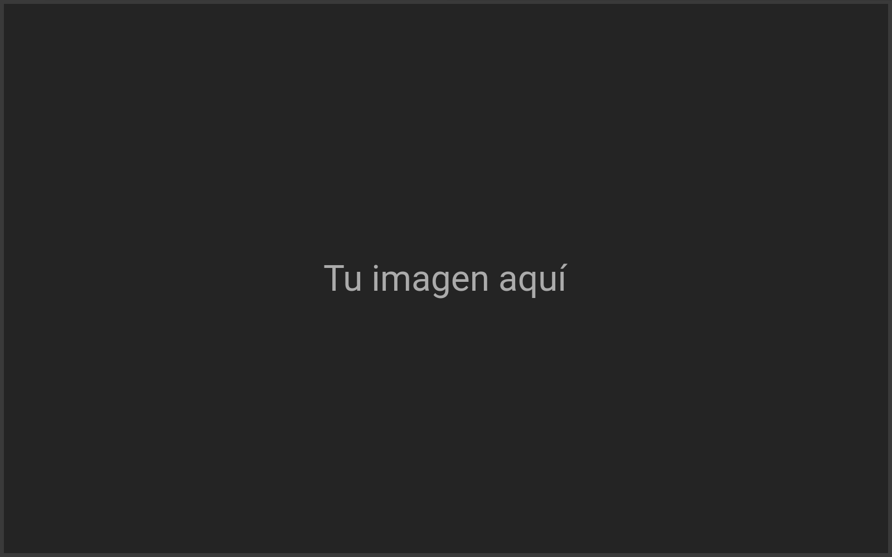
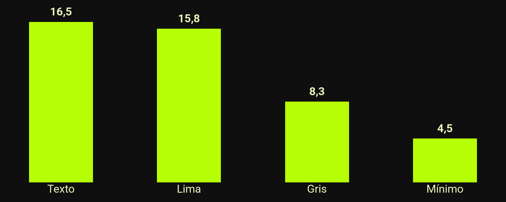
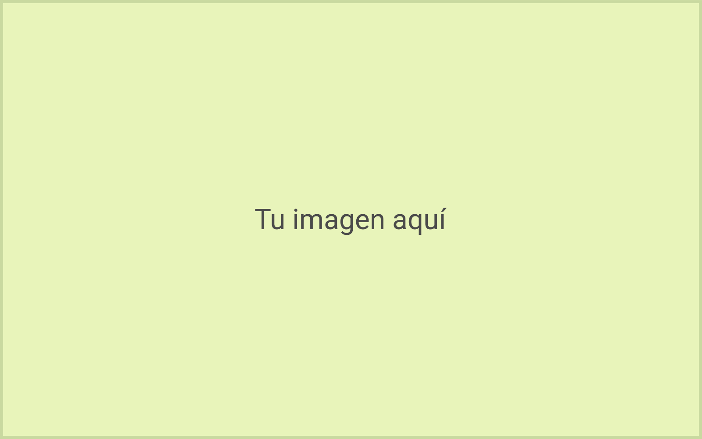
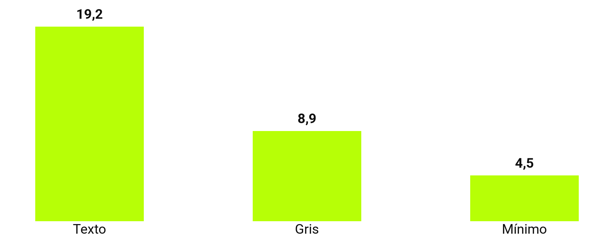

<!-- _class: capa -->
<!-- _paginate: false -->
<!-- _footer: "" -->

<div class="selo">14 al 19<br>de octubre<br>de 2026<br>{Floripa/SC}</div>

# ¡Qué bueno que vas a dar una charla!

Presiona P para ver los consejos

**Tu nombre aquí** · @tu_usuario

<!--
- Para empezar: copia las diapositivas que quieras usar y borra los ejemplos. El comentario _class al inicio de cada diapositiva elige el diseño.
- Cada diapositiva trae un consejo; usa los que te sirvan. La versión clara de los diseños viene después del cierre oscuro.
- Python Brasil existe porque personas como tú suben al escenario y comparten lo que saben.
-->

---

<!-- _class: frase -->

# La sala quiere que te vaya bien.

<!--
- Una idea por diapositiva, en hasta dos líneas. ¿Qué frase quieres que se lleve el público?
- Casi todas las personas que dan charlas se ponen nerviosas. Si llegan los nervios, háblale a una cara amiga entre el público.
- Si algo falla, cuenta con calma lo que pasó y sigue adelante: la sala lo olvida en minutos.
-->

---

<!-- _class: palestrante -->


# Tu nombre aquí

### Lo que haces · dónde

- Quien abre la sesión suele presentarte
- Si hay poco tiempo, puedes quitar esta diapositiva
- Una autodescripción ayuda a quien no ve

<!--
- Quien abre la sesión suele presentarte; si hay poco tiempo, puedes quitar esta diapositiva.
- Una autodescripción ayuda a quien no ve, por ejemplo: "Soy María, mido 1,60 m, tengo el pelo negro suelto, lentes verdes y una camiseta de PyLadies."
-->

---

> Lo práctico gana a lo puro.

The Zen of Python, PEP 20

Consejos, <mark>no reglas</mark>: usa los que te sirvan.

<!--
- Hasta tres líneas, con quién lo dijo y dónde. Conviene confirmar la autoría en una fuente primaria.
- Las comillas verdes vienen del tema: empieza la línea de la cita con > y escríbela sin comillas.
- Tu manera de hablar vale más que cualquier consejo de esta plantilla.
-->

---

## A la hora de empezar

- Suelta el aire despacio y toma un sorbo de agua
- El público está de tu lado
- Habla más despacio y respira entre frases
- La charla es tuya, a tu ritmo

<!--
- De tres a cinco puntos por diapositiva. Si el texto no cabe, dos diapositivas se leen mejor.
- Llegar temprano al lugar te da tiempo para conocer la sala, respirar y conversar.
-->

---

## Agenda

1. Muestra al público el camino de la charla
2. De tres a cinco partes suelen bastar
3. Puedes volver aquí entre una parte y otra
4. Cada parte también puede empezar con una sección
5. Opcional: puedes quitarla si hay poco tiempo

<!--
- La numeración es automática.
- Volver a la agenda entre las partes ayuda al público a saber dónde está.
-->

---

<!-- _class: secao -->
<!-- _paginate: false -->
<!-- _footer: "" -->

# _01_ Una sección para cada parte de la agenda

<!--
- El número entre guiones bajos va al disco lima: # _01_ Título.
- Repetir el nombre de la parte de la agenda ayuda al público a ubicarse.
-->

---

<!-- _class: duas-colunas -->

## Texto en la diapositiva

### En lugar de

- Párrafos enteros
- Leer la diapositiva en voz alta
- Reducir la letra para que quepa
- El guion en la diapositiva

### Prueba

- Una idea por diapositiva
- Decir lo que la diapositiva no dice
- Dividir en dos diapositivas
- El guion en las notas

<!--
- Cada columna tiene su título: antes y después, problema y solución.
- El detalle y el guion van a las notas, que solo tú ves.
-->

---

## Imágenes que explican



- Un diagrama en lugar de un párrafo
- Una imagen por idea
- Descríbela para quien no ve

<!--
- La imagen se agrega con ; el texto ocupa el resto de la diapositiva.
- Escribe el texto alternativo entre los corchetes de cada imagen que no sea de fondo.
- Al hablar, di lo que muestra la imagen, para quien no ve y para quien escucha la grabación.
-->

---

## Licencia y crédito


- Fotos tuyas o de licencia libre
- ¿La licencia permite este uso?
- El crédito de autoría en la diapositiva
- Al menos 1000 px de altura

<!--
- Las fotos de personas, lugares y productos funcionan bien aquí: cambia right por left para que la imagen vaya a la izquierda.
- Confirma que la licencia de la foto permite usarla en una charla grabada y da el crédito: Foto: nombre, licencia, sitio.
-->

---

<!-- _class: tres-imagens -->

## Capturas de pantalla legibles

-  Solo la parte que importa
-  Letra grande antes de capturar
-  Sin contraseñas, tokens ni correos

<!--
- Antes de capturar la pantalla, aumenta el zoom del navegador o el tamaño de letra de la terminal.
- Revisa si la captura muestra contraseñas, tokens, correos, pestañas o notificaciones.
-->

---

## Código: 8 líneas caben bien

```python
@dataclass
class Charla:
    titulo: str
    duracion_min: int = 25

    def cabe_en_bloque(self, bloque_min: int) -> bool:
        # Reserva 5 minutos para preguntas
        return self.duracion_min + 5 <= bloque_min
```


<!--
- Si tu charla no tiene código, puedes saltar esta diapositiva.
- Hasta 8 líneas y 60 columnas. Si el fragmento es más largo, divídelo en varias diapositivas o muestra solo lo que importa.
- Marp colorea el código por su cuenta: abre el bloque con ```python, o con el lenguaje del fragmento.
-->

---

<!-- _class: duas-colunas miuda -->

## Un ejemplo más corto también enseña

### 20 líneas, letra diminuta :(

```python
from dataclasses import dataclass
from datetime import datetime, timedelta

@dataclass
class Charla:
    titulo: str
    inicio: datetime
    duracion_min: int = 25

    @property
    def fin(self) -> datetime:
        return self.inicio + timedelta(minutes=self.duracion_min)

    def choca_con(self, otra: "Charla") -> bool:
        return self.inicio < otra.fin and otra.inicio < self.fin

    def cabe_en_bloque(self, bloque_min: int) -> bool:
        # Reserva 5 minutos para preguntas
        return self.duracion_min + 5 <= bloque_min
```

### 4 líneas, letra grande :)

```python
def cabe(charla, bloque):
    # 5 min para preguntas
    fin = charla.duracion + 5
    return fin <= bloque
```

<!--
- Antes y después de una refactorización, o dos formas de resolver el mismo problema.
- Cada columna acepta hasta 8 líneas y 30 columnas. La de la izquierda, con la clase miuda, muestra cómo se ve la letra diminuta proyectada.
-->

---

<!-- _class: numeros -->

## Tres números que ayudan

- **18** puntos: letra mínima para quien está lejos
- **8** líneas de código caben bien
- **5** minutos para preguntas al final

<!--
- Hasta tres números, cada uno con una etiqueta de lo que mide.
- El número va en negrita al inicio del punto: - **18** etiqueta.
-->

---

<!-- _class: cartoes -->

## Antes de subir al escenario

1. **Live coding** Plan B: capturas de pantalla o un video de la demo.
2. **Internet** La red puede caerse: descarga videos y páginas antes.
3. **Archivo** Lleva las diapositivas en PDF en una memoria USB.

<!--
- Elige el plan B que vaya con tu charla y prueba antes el cambio en tu computadora.
- Con charlas seguidas, no siempre hay tiempo de probar el sonido; un video subtitulado funciona sin audio.
- Si algo falla de todos modos, la sala lo entiende: pasa en todas las conferencias.
-->

---

## Tu día de charla

| Cuándo | Sugerencia |
|---|---|
| Antes del evento | Preguntar en el grupo de ponentes en Telegram |
| La víspera | ¡Ojo con el karaoke! Cuida la voz y descansa |
| El día | Llegar temprano y probar tu laptop en el proyector |
| 15 min antes | Saludar al equipo de voluntariado de la sala |
| En la charla | Micrófono cerca de la boca, aun viendo la pantalla |
| Después | Publicar las diapositivas en el enlace del QR |

<!--
- Las tablas en Markdown ya salen con el encabezado lima.
- Puede que no haya tiempo de probar en la sala: prueba antes el adaptador de video y la opción de duplicar pantalla de tu computadora.
- Cada sala tiene una persona voluntaria. Proyector, micrófono, ánimo: si algo falla, te ayudamos.
-->

---

## Contraste de los colores de esta plantilla



¿Otros colores? Revisa el contraste en [webaim.org/resources/contrastchecker](https://webaim.org/resources/contrastchecker/)

<!--
- Marp no tiene gráficos nativos: genera la imagen con matplotlib, como en scripts/grafico.py (uv run scripts/grafico.py).
- Escribe los números del gráfico en el texto alternativo, para los lectores de pantalla.
- Si usas otros colores, revisa el contraste en webaim.org/resources/contrastchecker.
-->

---

<!-- _class: fluxo -->

## Un día de evento

1. Charlas
2. Coffee break
3. Lightning talks
4. PyBar

<!--
- Un flujo muestra una secuencia: los pasos de un proceso, las etapas de un pipeline, el programa del día.
- Recorre el flujo de izquierda a derecha y señala con palabras: primero, después, al final.
-->

---

<!-- _class: imagem-cheia -->
<!-- _paginate: false -->
<!-- _footer: "" -->


Imagen a pantalla completa con leyenda. Foto: Nombre de la Persona · CC BY 4.0

<!--
- Cambia el archivo en . La leyenda es el último párrafo de la diapositiva.
- Da el crédito de la foto en la leyenda, como en el ejemplo.
-->

---

<!-- _class: destaque -->

## Tu charla es para todo el público

- Hay público infantil: contenido para todas las edades
- Humor sin víctimas y ejemplos sin estereotipos
- Si dudas de algún contenido, la organización te ayuda

<!--
- El código de conducta de Python Brasil aplica a todas las personas del evento, también en el escenario: python.org.br/cdc.
- Si sufres o presencias acoso, discriminación o humillación, busca al Equipo de Respuesta.
-->

---

## Referencias

- Código de conducta de Python Brasil [python.org.br/cdc](https://python.org.br/cdc)
- Tema Marp para diapositivas [marp.app](https://marp.app)
- Fuentes Roboto y Cascadia Mono [fonts.google.com](https://fonts.google.com)
- Verificador de contraste [webaim.org/resources/contrastchecker](https://webaim.org/resources/contrastchecker/)

<!--
- Un material por línea, con el nombre y la URL corta.
- Una sola página con todos los enlaces (un README, un gist o un Linktree) cabe en un código QR en el cierre.
-->

---

<!-- _class: encerramento -->
<!-- _paginate: false -->
<!-- _footer: "" -->

# ¿Preguntas?

**Tu nombre aquí**
_@tu_usuario_
_tu@ejemplo.com_

### Continúa: versión clara con más consejos →


2026.pythonbrasil.org.br

<!--
- El código QR lleva al público a tus diapositivas desde el celular. Con una sola página, puedes cambiar los enlaces después sin cambiar el código QR.
- Para generar tu código QR: uv run scripts/qr.py https://tu-direccion. El script reemplaza el archivo img/qr.png.
- Esta no es la última diapositiva: la versión clara de los diseños viene a continuación, con más consejos.
-->

---

<!-- _class: capa light -->
<!-- _paginate: false -->
<!-- _footer: "" -->

<div class="selo">14 al 19<br>de octubre<br>de 2026<br>{Floripa/SC}</div>

# Todos los diseños tienen versión clara

Para salas iluminadas o proyectores débiles

**Tu nombre aquí** · @tu_usuario

<!--
- En una sala muy iluminada o con un proyector débil, el fondo claro se lee mejor.
- Pregunta a la organización cómo es tu sala.
-->

---

<!-- _class: secao light -->
<!-- _paginate: false -->
<!-- _footer: "" -->

# _02_ Una pausa para respirar y tomar agua

<!--
- Entre una parte y otra, haz una pausa: respira y toma un sorbo de agua.
- La pausa parece larga para quien habla y corta para quien escucha.
-->

---

<!-- _class: light -->

## Tu pantalla en el proyector

- Notificaciones apagadas (modo No molestar)
- Fondo de pantalla neutro
- Solo las pestañas y los programas de la charla
- Ventana privada: el historial no aparece al escribir direcciones

<!--
- El proyector muestra todo lo que aparece en tu pantalla: activa el modo No molestar antes de subir al escenario.
- En una ventana privada, el navegador no sugiere direcciones del historial.
-->

---

<!-- _class: duas-colunas light -->

## Un ensayo en voz alta ayuda

### Ensayar

- Con cronómetro
- Con alguien mirando
- En la computadora que vas a usar

### Recortar

- Lo que se pase del tiempo
- Detalles que caben en las notas
- Diapositivas que saltas al ensayar

<!--
- Un ensayo completo en voz alta muestra cuánto dura la charla.
- Si solo la ensayas en tu cabeza, la charla suele pasarse de tiempo.
-->

---

<!-- _class: light -->

## Imágenes accesibles



- Texto alternativo en cada imagen
- Leyenda corta si la imagen no es obvia
- Información que no depende solo del color

<!--
- Parte del público tiene daltonismo o baja visión.
- Acompaña el color con una etiqueta o un ícono: en lugar de un punto verde y uno rojo, escribe también "pasó" y "falló".
-->

---

<!-- _class: light -->

## Mirar a los ojos


- Mirar a una persona amiga, no solo a la pantalla
- Las notas de la diapositiva como apoyo
- Señalar con palabras, no con el mouse

<!--
- Las notas aparecen solo para ti en la vista del presentador.
- En el HTML exportado, presiona P: la vista del presentador muestra las notas, la siguiente diapositiva y el cronómetro.
-->

---

<!-- _class: light -->

## Código: 8 líneas caben bien

```python
@dataclass
class Charla:
    titulo: str
    duracion_min: int = 25

    def cabe_en_bloque(self, bloque_min: int) -> bool:
        # Reserva 5 minutos para preguntas
        return self.duracion_min + 5 <= bloque_min
```

<!--
- La tarjeta sigue oscura, para que el código tenga el mismo contraste.
- El resaltado de sintaxis también viene del tema en el fondo claro.
-->

---

<!-- _class: light -->

> <mark>Pessoas</mark> &gt; Tecnologia

Comunidad Python Brasil, 2016

<!--
- Destaca la palabra principal con el resaltador lima: <mark>palabra</mark>.
- El lema de la comunidad Python Brasil desde 2016.
-->

---

<!-- _class: frase light -->

# Menos texto, letra más grande.

<!--
- Con menos texto en la diapositiva, la letra crece y la atención del público queda en ti.
-->

---

<!-- _class: destaque light -->

## Habla de forma acogedora

- Muestra el paso a paso en vez de decir que es fácil
- Explica cada sigla la primera vez que aparece
- Pregunta quién ya lo usó en vez de suponer

<!--
- El panel lima guarda el mensaje que la sala no puede perderse; hasta cuatro puntos cortos al lado.
- Para quien está empezando, “solo tienes que” y “todo el mundo sabe” suenan a “deberías saberlo”.
- Para muchas personas, Python Brasil es su primera conferencia; un ejemplo cotidiano ayuda a quien acaba de llegar.
-->

---

<!-- _class: numeros light -->

## Accesibilidad en números

- **4,5:1** contraste mínimo del texto
- **1** idea por diapositiva
- **0** datos que dependan solo del color

<!--
- En el fondo blanco, el tema pone el número en el resaltador lima, con el texto negro.
- Una idea por diapositiva ayuda a quien lee despacio o usa lector de pantalla.
-->

---

<!-- _class: cartoes light -->

## Después de la charla

1. **Diapositivas** Publícalas en el enlace del QR el mismo día.
2. **Conversación** Quédate cerca: muchas preguntas llegan en el pasillo.
3. **Descanso** Toma agua y disfruta el evento. Te lo mereces.

<!--
- Publicar las diapositivas el mismo día ayuda a quien quiere repasar el contenido.
- Muchas personas prefieren preguntar en el pasillo; vale la pena quedarse un rato cerca.
- El cansancio después de presentar es normal: descansa y disfruta el resto del evento.
-->

---

<!-- _class: palestrante light -->


# Tu nombre aquí

### Pronombres, cargo y comunidad

- Dónde puede encontrarte el público
- Tres datos, no un currículum
- Una foto reciente

<!--
- Con los pronombres en la diapositiva, quien mencione tu charla después usará los correctos.
- Una foto reciente ayuda al público a encontrarte en los descansos.
-->

---

<!-- _class: fluxo light -->

## Del borrador al escenario

1. Escribir en Markdown
2. Ensayar en voz alta
3. Exportar a PDF
4. Presentar

<!--
- Una lista numerada se convierte en cajas con flechas; el último paso va en lima.
- De tres a cinco pasos caben en una línea. Para un flujo con ramas, divídelo en dos diapositivas.
-->

---

<!-- _class: light -->

## Contraste de los colores de esta plantilla



¿Otros colores? Revisa el contraste en [webaim.org/resources/contrastchecker](https://webaim.org/resources/contrastchecker/)

<!--
- Para generar el gráfico, mira las notas de la diapositiva 17.
-->

---

<!-- _class: encerramento light -->
<!-- _paginate: false -->
<!-- _footer: "" -->

# ¡Gracias!

**Nos alegra mucho tenerte en Python Brasil 2026.**

Cuenta con nosotros: estamos aquí para apoyarte y darte ánimo.

_Organización de Python Brasil 2026_


2026.pythonbrasil.org.br

<!--
- En tu charla, cambia el texto por tus contactos y el código QR por el enlace de tus diapositivas.
- En las preguntas, repite cada pregunta por el micrófono, para la sala y la grabación.
- "No lo sé, puedo revisarlo y te respondo después" es una buena respuesta. Una pregunta que no respeta el código de conducta no necesita respuesta.
-->

---

<!-- _class: figurinhas -->
<!-- _paginate: false -->
<!-- _footer: "" -->

## Stickers

### Dazumbanho! Chegasse ao fim, ixtepô!

    

 <span class="circulo">mira aquí</span> <mark>resaltador</mark>  

Identidad visual de Ana Terhorst, [anaterhorstdesign.com](https://anaterhorstdesign.com). ¡Gracias, Ana!

<!--
- "Dazumbanho! Chegasse ao fim, ixtepô!" es un saludo en el dialecto de Florianópolis, algo como "¡Caramba! Llegaste al final, ¡mira nada más!".
- Copia la línea del sticker a tu diapositiva; el w:200 define el ancho en píxeles.
- El resaltador es <mark>palabra</mark>, y el círculo pixelado es <span class="circulo">palabra</span>.
- Un sticker por diapositiva suele bastar.
-->
