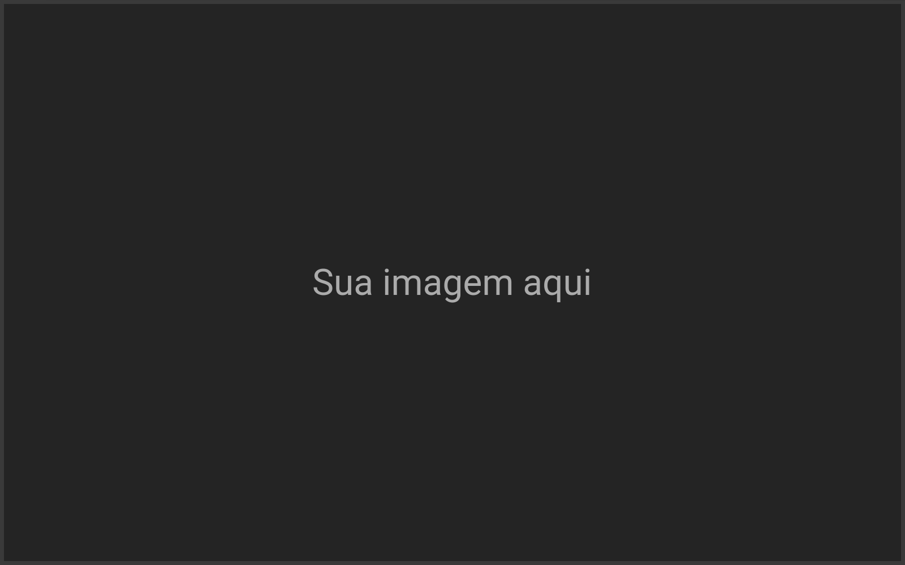
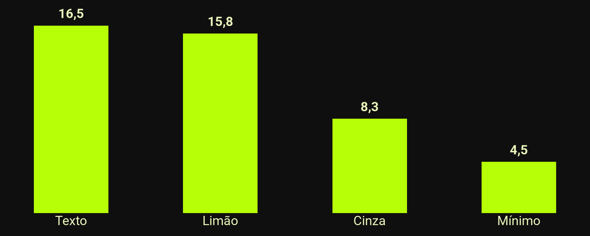
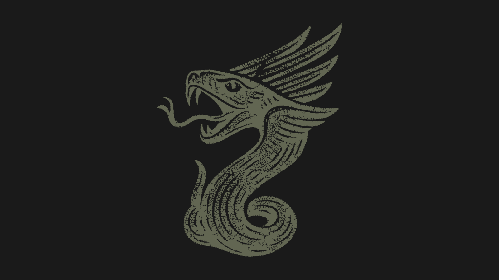
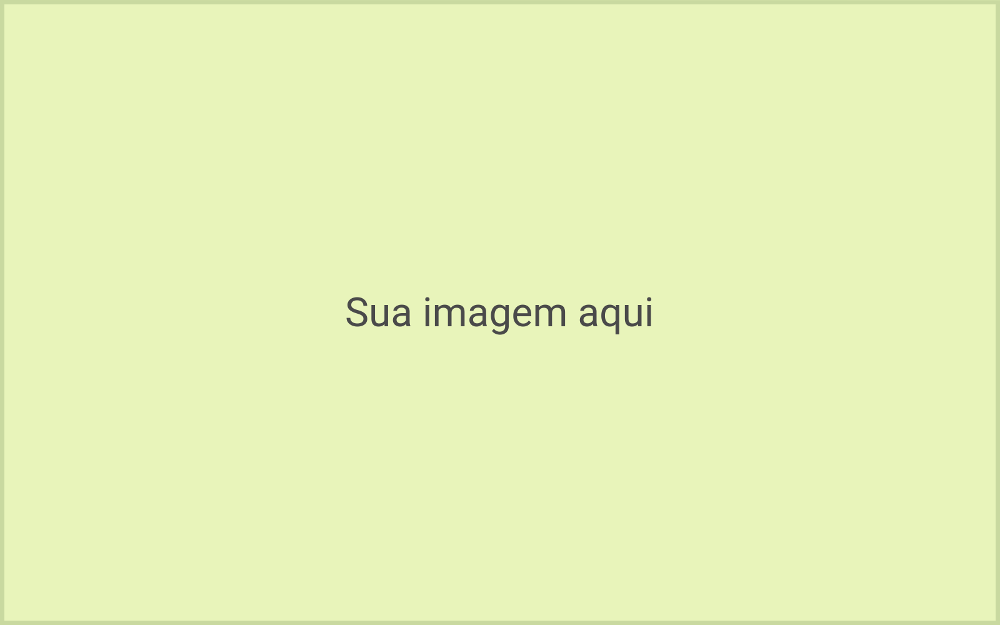
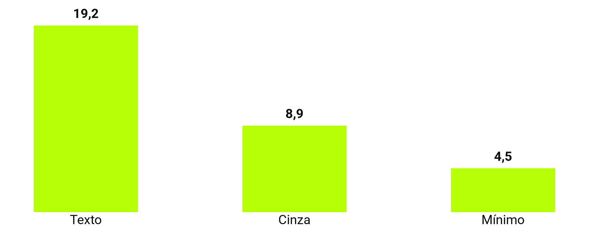
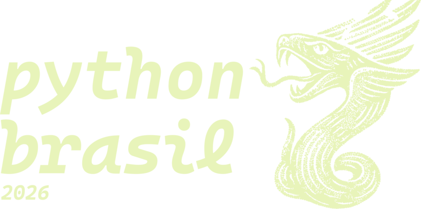
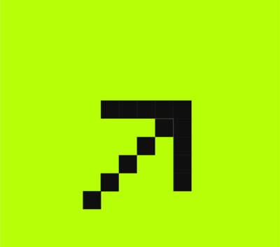
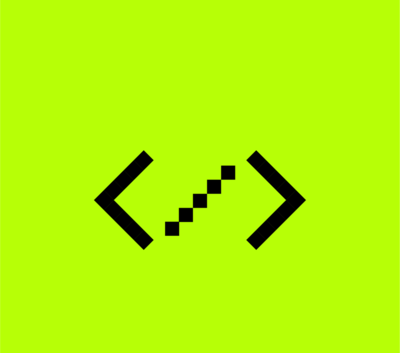

<!-- _class: capa -->
<!-- _paginate: false -->
<!-- _footer: "" -->

<div class="selo">14 a 19<br>de outubro<br>de 2026<br>{Floripa/SC}</div>

# Que bom que você vai palestrar na Python Brasil 2026

Aperte P para ver as dicas de cada slide

**Seu nome aqui** · @seu_usuario

<!--
- Para começar: copie os slides que quiser usar e apague os exemplos. O comentário _class no topo de cada slide escolhe o layout.
- Cada slide traz uma dica; use as que servirem para você. A versão clara dos layouts vem depois do encerramento escuro.
- A Python Brasil existe porque pessoas como você sobem ao palco e compartilham o que sabem.
-->

---

<!-- _class: frase -->

# A sala está torcendo por você.

<!--
- Uma ideia por slide, em até duas linhas. Que frase o público deve levar da sala?
- Quase toda pessoa palestrante fica nervosa. Se bater o nervosismo, fale para um rosto amigo na plateia.
- Se algo falhar, comente com calma o que aconteceu e siga em frente: a sala esquece em minutos.
-->

---

<!-- _class: palestrante -->


# Seu nome aqui

### O que você faz · onde

- Quem abre a sessão costuma apresentar você
- Com o tempo curto, este slide pode sair
- Uma autodescrição ajuda quem não vê

<!--
- Quem abre a sessão costuma apresentar você; com o tempo curto, este slide pode sair.
- Uma autodescrição ajuda quem não vê, por exemplo: "Sou a Maria, tenho 1,60 m, cabelo preto solto, óculos verdes e uma camiseta da PyLadies."
-->

---

> A praticidade vence a pureza.

The Zen of Python, PEP 20

Dicas, <mark>não regras</mark>: use as que servirem para você.

<!--
- Até três linhas, com quem disse e onde. Vale conferir a autoria numa fonte primária.
- As aspas verdes vêm do tema: comece a linha da citação com > e escreva sem aspas.
- O seu jeito de falar vale mais do que qualquer dica deste modelo.
-->

---

## Na hora de começar

- Solte o ar devagar e beba um gole de água
- O público está do seu lado
- Fale mais devagar e respire entre as frases
- A palestra é sua, no seu ritmo

<!--
- De três a cinco tópicos por slide. Se o texto não couber, dois slides leem melhor.
- Chegar cedo ao local dá tempo de conhecer a sala, respirar e conversar.
-->

---

## Agenda

1. Mostra ao público o caminho da palestra
2. Três a cinco partes costumam bastar
3. Pode voltar entre uma parte e outra
4. Cada parte também pode abrir com uma seção
5. Opcional: pode sair se o tempo for curto

<!--
- A numeração é automática.
- Voltar à agenda entre as partes ajuda o público a saber onde está.
-->

---

<!-- _class: secao -->
<!-- _paginate: false -->
<!-- _footer: "" -->

# _01_ Uma seção para cada parte da agenda

<!--
- O número entre sublinhados vai para o disco limão: # _01_ Título.
- Repetir o nome da parte da agenda ajuda o público a se localizar.
-->

---

<!-- _class: duas-colunas -->

## Texto no slide

### Em vez de

- Parágrafos inteiros
- Ler o slide em voz alta
- Diminuir a fonte para caber
- A “colinha” no slide

### Experimente

- Uma ideia por slide
- Falar o que o slide não diz
- Dividir em dois slides
- A “colinha” nas anotações

<!--
- Cada coluna tem o seu título: antes e depois, problema e solução.
- O detalhe e a “colinha” vão para as anotações, que só você vê.
-->

---

## Imagens que explicam



- Um diagrama no lugar de um parágrafo
- Uma imagem por ideia
- Descreva para quem não vê

<!--
- A imagem entra com ; o texto ocupa o resto do slide.
- Escreva o texto alternativo entre os colchetes de cada imagem que não seja de fundo.
- Na fala, diga o que a imagem mostra, para quem não enxerga e para quem ouve a gravação.
-->

---

## Licença e crédito


- Fotos suas ou de licença livre
- A licença permite este uso?
- Crédito da autoria no slide
- Pelo menos 1000 px de altura

<!--
- Fotos de pessoas, lugares e produtos funcionam bem aqui: troque right por left para a imagem ir à esquerda.
- Confira se a licença da foto permite o uso numa palestra gravada e dê o crédito: Foto: nome, licença, site.
-->

---

<!-- _class: tres-imagens -->

## Capturas de tela legíveis

-  Só a parte que importa
-  Fonte grande antes de capturar
-  Sem senhas, tokens nem e-mails

<!--
- Antes de capturar a tela, aumente o zoom do navegador ou a fonte do terminal.
- Confira se a captura mostra senhas, tokens, e-mails, abas ou notificações.
-->

---

## Código: 8 linhas cabem bem

```python
@dataclass
class Palestra:
    titulo: str
    duracao_min: int = 25

    def cabe_no_slot(self, slot_min: int) -> bool:
        # Reserva 5 minutos para perguntas
        return self.duracao_min + 5 <= slot_min
```


<!--
- Se a sua palestra não tem código, pode pular este slide.
- Até 8 linhas e 60 colunas. Se o trecho for maior, divida em slides ou mostre só o que importa.
- O Marp colore o código sozinho: abra o bloco com ```python, ou com a linguagem do trecho.
-->

---

<!-- _class: duas-colunas miuda -->

## Um exemplo menor também ensina

### 20 linhas, letra miúda :(

```python
from dataclasses import dataclass
from datetime import datetime, timedelta

@dataclass
class Palestra:
    titulo: str
    inicio: datetime
    duracao_min: int = 25

    @property
    def fim(self) -> datetime:
        return self.inicio + timedelta(minutes=self.duracao_min)

    def conflita_com(self, outra: "Palestra") -> bool:
        return self.inicio < outra.fim and outra.inicio < self.fim

    def cabe_no_slot(self, slot_min: int) -> bool:
        # Reserva 5 minutos para perguntas
        return self.duracao_min + 5 <= slot_min
```

### 4 linhas, letra grande :)

```python
def cabe(palestra, slot):
    # 5 min para perguntas
    fim = palestra.duracao + 5
    return fim <= slot
```

<!--
- Antes e depois de uma refatoração, ou duas formas de resolver o mesmo problema.
- Cada coluna aceita até 8 linhas e 30 colunas. A da esquerda, com a classe miuda, mostra como fica a letra miúda no telão.
-->

---

<!-- _class: numeros -->

## Três números que ajudam

- **18** pontos: fonte mínima para quem está longe
- **8** linhas de código cabem bem
- **5** minutos para perguntas no fim

<!--
- Até três números, cada um com um rótulo do que mede.
- O número vai em negrito no começo do item: - **18** rótulo.
-->

---

<!-- _class: cartoes -->

## Antes de subir no palco

1. **Live coding** Plano B: capturas de tela ou um vídeo da demo.
2. **Internet** A rede pode cair: baixe vídeos e páginas antes.
3. **Arquivo** Leve os slides em PDF num pendrive.

<!--
- Escolha o plano B que combina com a sua palestra e teste a troca no seu computador antes.
- Com palestras emendadas, nem sempre dá para testar o som; um vídeo legendado funciona sem áudio.
- Se algo falhar mesmo assim, a sala entende: acontece em toda conferência.
-->

---

## O seu dia de palestra

| Quando | Sugestão |
|---|---|
| Antes do evento | Tirar dúvidas no grupo de palestrantes no Telegram |
| Na véspera | Pega leve no karaokê! Voz e descanso em dia |
| No dia | Chegar cedo e testar o notebook no projetor da sala |
| 15 min antes | Dar um oi ao voluntariado da sala |
| Na palestra | Microfone perto da boca, mesmo ao olhar para o telão |
| Depois | Publicar os slides no link do QR code |

<!--
- Tabelas em Markdown já saem com o cabeçalho limão.
- Pode não haver tempo de testar na sala: teste antes o adaptador de vídeo e o espelhamento de tela do seu computador.
- Cada sala tem alguém do voluntariado. Projetor, microfone, coragem: o que falhar, a gente ajuda.
-->

---

## Contraste das cores deste modelo



Outras cores? Confira o contraste em [webaim.org/resources/contrastchecker](https://webaim.org/resources/contrastchecker/)

<!--
- O Marp não tem gráfico nativo: gere a imagem com matplotlib, como em scripts/grafico.py (uv run scripts/grafico.py).
- Escreva os números do gráfico no texto alternativo, para leitores de tela.
- Se usar outras cores, confira o contraste em webaim.org/resources/contrastchecker.
-->

---

<!-- _class: fluxo -->

## Um dia de evento

1. Palestras
2. Coffee break
3. Lightning talks
4. PyBar

<!--
- Um fluxo mostra uma sequência: os passos de um processo, as etapas de um pipeline, a programação do dia.
- Conte o fluxo da esquerda para a direita, apontando com palavras: primeiro, depois, no fim.
-->

---

<!-- _class: imagem-cheia -->
<!-- _paginate: false -->
<!-- _footer: "" -->



Imagem cheia com legenda. Foto: Nome da Pessoa · CC BY 4.0

<!--
- Troque o arquivo em . A legenda é o último parágrafo do slide.
- Dê o crédito da foto na legenda, como no exemplo.
-->

---

<!-- _class: destaque -->

## Sua palestra é para todo mundo

- O público inclui crianças: conteúdo para todas as idades
- Humor sem alvo e exemplos sem estereótipos
- Na dúvida sobre algum conteúdo, a organização ajuda

<!--
- O código de conduta da Python Brasil vale para todas as pessoas no evento, inclusive no palco: python.org.br/cdc.
- Se você sofrer ou presenciar assédio, discriminação ou humilhação, procure a Equipe de Resposta.
-->

---

## Referências

- Código de conduta da Python Brasil [python.org.br/cdc](https://python.org.br/cdc)
- Tema Marp para slides [marp.app](https://marp.app)
- Fontes Roboto e Cascadia Mono [fonts.google.com](https://fonts.google.com)
- Verificador de contraste [webaim.org/resources/contrastchecker](https://webaim.org/resources/contrastchecker/)

<!--
- Um material por linha, com o nome e o endereço curto.
- Uma página só com todos os links (um README, um gist ou um Linktree) cabe num QR code no encerramento.
-->

---

<!-- _class: encerramento -->
<!-- _paginate: false -->
<!-- _footer: pessoas > tecnologia -->

# Perguntas?

**Seu nome aqui**
_@seu_usuario_
_voce@exemplo.com.br_

### Continua: versão clara com mais dicas →


2026.pythonbrasil.org.br

<!--
- O QR code leva o público aos seus slides pelo celular. Com uma página só, você troca os links depois sem mudar o QR code.
- Para gerar o seu QR code: uv run scripts/qr.py https://seu-endereco. O script troca o arquivo img/qr.png.
- Este não é o último slide: a versão clara dos layouts vem a seguir, com mais dicas.
-->

---

<!-- _class: capa light -->
<!-- _paginate: false -->
<!-- _footer: "" -->

<div class="selo">14 a 19<br>de outubro<br>de 2026<br>{Floripa/SC}</div>

# Todos os layouts têm versão clara

Para salas claras ou projetores fracos

**Seu nome aqui** · @seu_usuario

<!--
- Em sala muito iluminada ou com projetor fraco, o fundo claro fica mais legível.
- Pergunte à organização como é a sua sala.
-->

---

<!-- _class: secao light -->
<!-- _paginate: false -->
<!-- _footer: "" -->

# _02_ Uma pausa para respirar e beber água

<!--
- Entre uma parte e outra, faça uma pausa: respire e beba um gole de água.
- A pausa parece longa para quem fala e curta para quem ouve.
-->

---

<!-- _class: light -->

## A sua tela no telão

- Notificações desligadas (modo Não perturbe)
- Papel de parede neutro
- Só as abas e os programas da palestra
- Janela anônima: o histórico não aparece ao digitar endereços

<!--
- O telão mostra tudo o que aparece na sua tela: ative o modo Não perturbe antes de subir ao palco.
- Numa janela anônima, o navegador não sugere endereços do histórico.
-->

---

<!-- _class: duas-colunas light -->

## Um ensaio em voz alta ajuda

### Ensaiar

- Com cronômetro
- Com alguém assistindo
- No computador do dia

### Cortar

- O que passar do tempo
- Detalhes que cabem nas anotações
- Slides que você pula ao ensaiar

<!--
- Um ensaio completo em voz alta mostra quanto tempo a palestra leva.
- Ensaiada só na cabeça, a palestra costuma passar do tempo.
-->

---

<!-- _class: light -->

## Imagens acessíveis



- Texto alternativo em toda imagem
- Legenda curta se a imagem não for óbvia
- Informação que não depende só da cor

<!--
- Parte do público tem daltonismo ou baixa visão.
- Junte a cor a um rótulo ou ícone: em vez de uma bolinha verde e uma vermelha, escreva também "passou" e "falhou".
-->

---

<!-- _class: light -->

## Olho no olho


- Olhar para uma pessoa amiga, não só para a tela
- As anotações do slide como apoio
- Apontar com palavras, não com o mouse

<!--
- As anotações aparecem só para você na visão do apresentador.
- No HTML exportado, aperte P: a visão do apresentador mostra as anotações, o próximo slide e o cronômetro.
-->

---

<!-- _class: light -->

## Código: 8 linhas cabem bem

```python
@dataclass
class Palestra:
    titulo: str
    duracao_min: int = 25

    def cabe_no_slot(self, slot_min: int) -> bool:
        # Reserva 5 minutos para perguntas
        return self.duracao_min + 5 <= slot_min
```

<!--
- O cartão continua escuro, para o código ter o mesmo contraste.
- O realce de sintaxe vem do tema também no fundo claro.
-->

---

<!-- _class: light -->

> <mark>Legibilidade</mark> conta.

PEP 20

<!--
- Destaque a palavra principal com o marca-texto limão: <mark>palavra</mark>.
- A PEP 20 aparece no terminal com import this.
-->

---

<!-- _class: frase light -->

# Menos texto, letra maior.

<!--
- Com menos texto no slide, a letra fica maior e a atenção do público fica em você.
-->

---

<!-- _class: destaque light -->

## Fale de um jeito que acolhe

- Mostre o passo a passo em vez de dizer que é fácil
- Explique cada sigla na primeira vez
- Pergunte quem já usou em vez de supor

<!--
- O painel limão guarda a mensagem que a sala não pode perder; até quatro tópicos curtos ao lado.
- Para quem está começando, “é só” e “todo mundo sabe” soam como “você deveria saber”.
- Muita gente chega à Python Brasil na primeira conferência; um exemplo do dia a dia ajuda quem chegou agora.
-->

---

<!-- _class: numeros light -->

## Acessibilidade em números

- **4,5:1** contraste mínimo do texto
- **1** ideia por slide
- **0** informações passadas só pela cor

<!--
- No fundo branco, o tema põe o número no marca-texto limão, com o texto preto.
- Uma ideia por slide ajuda quem lê devagar ou usa leitor de tela.
-->

---

<!-- _class: cartoes light -->

## Depois da palestra

1. **Slides** Publique os slides no link do QR code no mesmo dia.
2. **Conversa** Fique por perto: muita pergunta chega no corredor.
3. **Descanso** Beba água e aproveite o evento. Você mereceu.

<!--
- Publicar os slides no mesmo dia ajuda quem quer rever o conteúdo.
- Muita gente prefere perguntar no corredor; vale ficar um pouco por perto.
- Cansaço depois de palestrar é normal: descanse e aproveite o resto do evento.
-->

---

<!-- _class: palestrante light -->


# Seu nome aqui

### Pronomes, cargo e comunidade

- Onde o público encontra você
- Três fatos, não um currículo
- Uma foto recente

<!--
- Com os pronomes no slide, quem cita a sua palestra depois acerta.
- Uma foto recente ajuda o público a encontrar você nos intervalos.
-->

---

<!-- _class: fluxo light -->

## Do rascunho ao palco

1. Escrever em Markdown
2. Ensaiar em voz alta
3. Exportar em PDF
4. Apresentar

<!--
- Uma lista numerada vira caixas com setas; o último passo leva o limão.
- De três a cinco passos cabem numa linha. Para um fluxo com ramos, divida em dois slides.
-->

---

<!-- _class: light -->

## Contraste das cores deste modelo



Outras cores? Confira o contraste em [webaim.org/resources/contrastchecker](https://webaim.org/resources/contrastchecker/)

<!--
- Para gerar o gráfico, veja as anotações do slide 17.
-->

---

<!-- _class: encerramento light -->
<!-- _paginate: false -->
<!-- _footer: pessoas > tecnologia -->

# Valeu!

**Ficamos muito felizes por ter você na Python Brasil 2026.**

Conte com a gente: estamos aqui para apoiar e torcer por você.

_Organização da Python Brasil 2026_


2026.pythonbrasil.org.br

<!--
- Na sua palestra, troque o texto pelos seus contatos e o QR code pelo link dos seus slides.
- Nas perguntas, repita cada pergunta no microfone, para a sala e a gravação.
- "Não sei, posso ver e te respondo depois" é uma boa resposta. Uma pergunta que desrespeita o código de conduta não precisa de resposta.
-->

---

<!-- _class: figurinhas -->

## Figurinhas

### Dazumbanho! Chegasse ao fim, ixtepô!

    

 <span class="circulo">olha aqui</span> <mark>marca-texto</mark>  

Identidade visual de Ana Terhorst, [anaterhorstdesign.com](https://anaterhorstdesign.com). Valeu, Ana!

<!--
- Copie a linha da figurinha para o seu slide; o w:200 define a largura em pixels.
- O marca-texto é <mark>palavra</mark>, e o círculo pixelado é <span class="circulo">palavra</span>.
- Uma figurinha por slide costuma bastar.
-->
